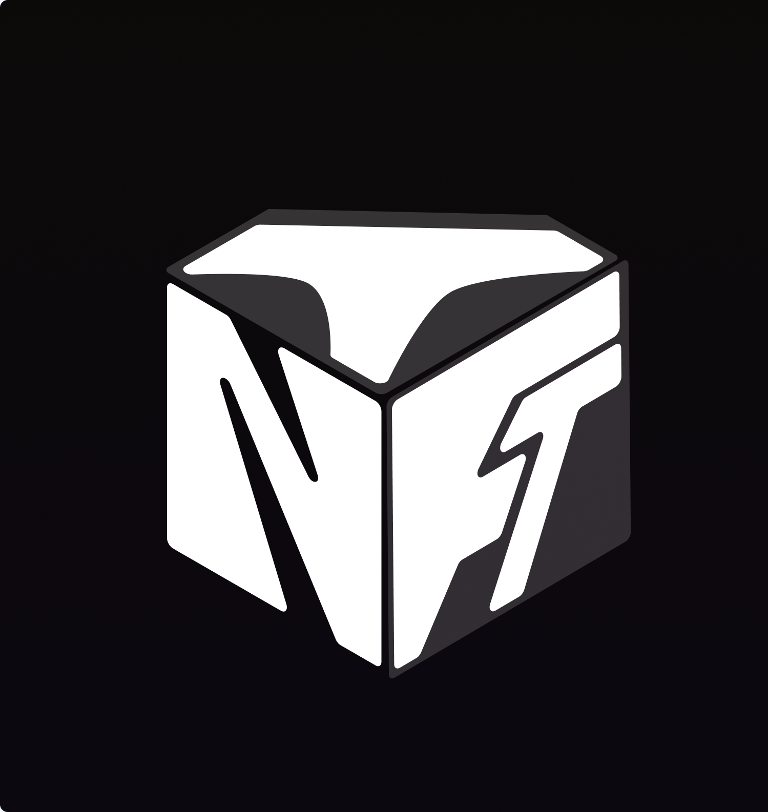
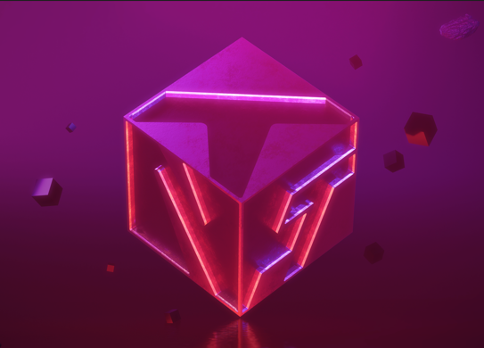

<!--
Hey, thanks for using the awesome-readme-template template.  
If you have any enhancements, then fork this project and create a pull request 
or just open an issue with the label "enhancement".

Don't forget to give this project a star for additional support ;)
Maybe you can mention me or this repo in the acknowledgements too
-->

  
  <h1>TNFT Labs</h1>
  
  <h3>
    Unlock the power of web3 with TNFT
  </h3>
  
  
<!-- Badges -->

  

  
  
  

   
<h4>
    <a href="https://github.com/Louis3797/awesome-readme-template/">View Demo</a>
   · 
    <a href="https://github.com/Louis3797/awesome-readme-template">Documentation</a>
   · 
    <a href="https://github.com/Louis3797/awesome-readme-template/issues/">Report Bug</a>
   · 
    <a href="https://github.com/Louis3797/awesome-readme-template/issues/">Request Feature</a>
  </h4>

 

<!-- Table of Contents -->

[//]: # (# :notebook_with_decorative_cover: Table of Contents)

[//]: # ()
[//]: # (- [About the Project]&#40;#star2-about-the-project&#41;)

[//]: # (  * [Screenshots]&#40;#camera-screenshots&#41;)

[//]: # (  * [Tech Stack]&#40;#space_invader-tech-stack&#41;)

[//]: # (  * [Features]&#40;#dart-features&#41;)

[//]: # (  * [Color Reference]&#40;#art-color-reference&#41;)

[//]: # (  * [Environment Variables]&#40;#key-environment-variables&#41;)

[//]: # (- [Getting Started]&#40;#toolbox-getting-started&#41;)

[//]: # (  * [Prerequisites]&#40;#bangbang-prerequisites&#41;)

[//]: # (  * [Installation]&#40;#gear-installation&#41;)

[//]: # (  * [Running Tests]&#40;#test_tube-running-tests&#41;)

[//]: # (  * [Run Locally]&#40;#running-run-locally&#41;)

[//]: # (  * [Deployment]&#40;#triangular_flag_on_post-deployment&#41;)

[//]: # (- [Usage]&#40;#eyes-usage&#41;)

[//]: # (- [Roadmap]&#40;#compass-roadmap&#41;)

[//]: # (- [Contributing]&#40;#wave-contributing&#41;)

[//]: # (  * [Code of Conduct]&#40;#scroll-code-of-conduct&#41;)

[//]: # (- [FAQ]&#40;#grey_question-faq&#41;)

[//]: # (- [License]&#40;#warning-license&#41;)

[//]: # (- [Contact]&#40;#handshake-contact&#41;)

[//]: # (- [Acknowledgements]&#40;#gem-acknowledgements&#41;)

  

<!-- About the Project -->
## :star2: About us

 
  

TNFT has opened an annex dedicated to the provision of services. Thanks to our technical team, we are able to offer the following services:

* Bots Telegram, Discord and custom Twitter
* Dapps webs
* Smarts contracts
* Nodes
* Websites and more...

On the other hand, our community spirit creates real links with our best members. And it's thanks to the sinergie we've created that we want to reward our contributors.

<!-- Checklist ( Node edition )-->
## :compass: Roadmap (Node edition)

* [x] Pryzm Node
* [x] Taiko Node Validator ( x3 )
* [x] Shardeum Node Validator ( x2 )
* [x] Linea Node
* [x] EigenLayer + Mangata Nodes
* [x] Berachain Node
* [x] Nulink
* [] Fuel Node

<!-- Contact -->
## :handshake: Contact

Castelli Valerio - [Github Profile](https://github.com/cstlli) - [@xCSTLLI](https://twitter.com/xcstlli) - valerio.castelli@tnft.fr

Ben - [Github Profile](https://github.com/xMazaki) - [@Mazaki.eth](https://twitter.com/mazaki_eth) - mazaki@tnft.fr
